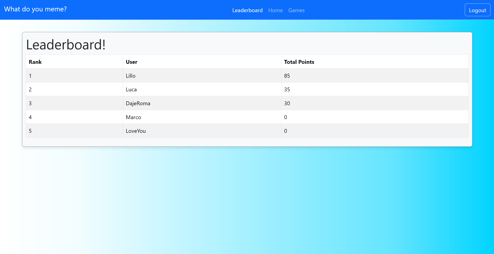
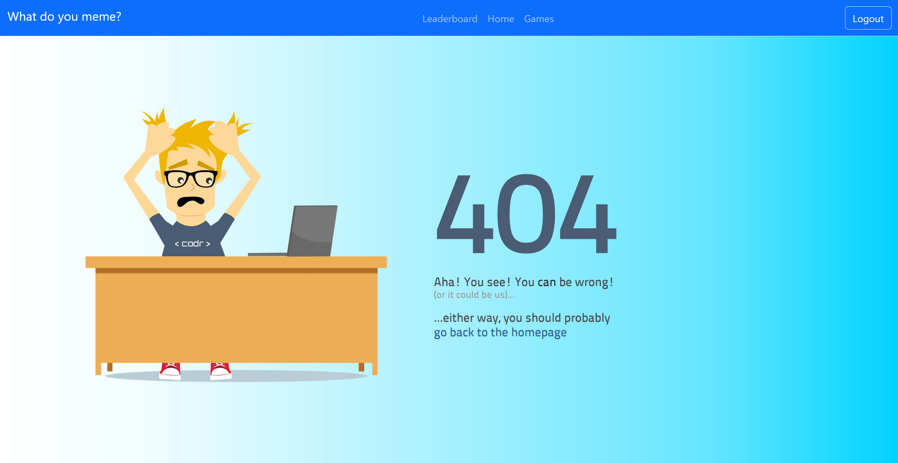

[](https://classroom.github.com/a/AVMm0VzU)
# Exam #42: "Meme Game"
## Student: s322848 GUZZONE SEBASTIANO 

## React Client Application Routes

- Route `/`: show the homepage and the button to start the anonymous game (1 round). If logged in, another button to play an entire game (3 rounds)
- Route `/leaderboard`: show the leaderboard and scores of all registered users, with a focus on the top 3.
- Route `/games`: if logged in, show the games history of the logged user. 
- Route `/play`: star a new game
- Route `/result`: show the result of the anonymous round.
- Route `/games/:game-id`: show more info about the result of a single games, with specific info about all the 3 rounds, the 2 corrected captions, the chosed one, and the total point per round.

- Route `/login`:  route to login by using credentials (username and password)
- Route `/*`: this route will be shown in case an invalid route is requested.

## Main React Components
- `Header` (in `Header.jsx`): Render the Navbar used in all the pages.
- `Home` (in `PageLayout.jsx`): Render a meme through the provided image.
- `NotFoundLayout` (in `PageLayout.jsx`): Shows a blank page if you search for an item that doesn't exist.


- `Round` (in `RoundBoard.jsx`): It manages the retrieval of information and the rendering of a new round to play.


- `RoundResult` (in `RoundBoard.jsx`): Shows the results of a specific round being passed through the props
- `GameResult` (in `RoundBoard.jsx`): Shows the total score of a game that was retrieved through the API and the id retrieved from the parameters. Reuse the "RoundResult" component 3 times.
- `GamesResult` (in `RoundBoard.jsx`): Shows the games of a given player, using a useState and useEffect to also manage the order of the games themselves by date.

- `MemeCard` (in `Meme.jsx`): Render a meme using the provided image and Bootstrap Cards

- `CaptionCard` (in `Caption.jsx`): Render a meme using the Bootstrap Cards


- `Timer` (in `Timer.jsx`): It manages the Timer and its graphic display, using an internal counter that decreases every 1000ms and calls the function passed as a parameter as soon as the timer (set through the props.) reaches 0.
- `LoginForm` (in `Auth.jsx`): Form that manages the insertion of user credentials.


## API Server

### Authentication and Sessions
- POST `/api/sessions`: perform the login
    - request body: `email`, `password`
    - response code: `200`
    - response body content: User info
    - error response code `401`

- GET `/api/sessions/current`: retrieve info about the req.user
    - request body: `None` 
    - response code: `200`
    - response body content: User info
    - error response code `401` if not logged in

- DELETE `/api/sessions/current`: perform the logout
    - request body: `None` 
    - response code: `200`

### Users
- GET `/api/users`: retrieve info (nickname, total_point) about all registered users
    - request body: `None` 
    - response code: `200`
    - response body content: array of users, subset of info for each user (nickname, total_point)
    - error response code `500` 
  ```
    [
      {
        "nickname":  "Lillo",
        "total_point": 15
      },
      ...
    ]
    ```

### Memes
- GET `/api/memes/random`: retrieve a random meme with 7 random captions, 2 of them are best captions
    - request body: Optional, if present there will be a list meme_ids that should not be chosen.
     ```
    [
      {
        "id": 1,
      },
      ...
    ]
    ```
    - response code: `200`
    - response body content: Meme info
    - error response code `500` 
  ```
  {
    "id":  3,
    "path_img": "img\luca_manganella.jpg"
    "captions": [
      {
        "id": 2,
        "description": "La caption più bella assai"
      },
      ....
    ] 
  }
    ```
    
### Games
- POST `/games`: Add a games and the three rounds into the db! (point will be calculated by the server, the user will be taken by req.user)
    - request body: Info about the 3 rounds and the memes used (example below)
    ```
    {
      "rounds" : [
        {
          "captionIds": [1,2,3,4,5,6,7],
          "selected_caption_id" : 2,"
          "meme_id": 1,
        },
        {
          "captionIds": [1,2,3,4,5,6,7],
          "selected_caption_id" : null,
          "meme_id": 2,
        },
        ....
      ]
    }
    ```
    - response code: `200`
    - response body content: The id of the game inserted.
    - error response code:  `401` if user not logged in, `422` if body content is not valid, `500` if an error occurred
    ```
      {"id":  1}
    ``` 
- GET `/games`: Show history of all games by the logged user
    - request body: `None` 
    - response code: `200`
    - response body content: Array of games (id, date, points)
    - error response code `401` if not authorized, `500` if there is an error
    ```
    [
      {
        "id":  1,
        "date": "2024-01-20"
        "total_point:" 15
      },
      ...
    ]
    ```

- GET `/games/:game_id`: Show info, from history, about a single game of a user, info about their 3 rounds
    - request body: `None` 
    - response code: `200`
    - response body content: Info about the game and the rounds
    - error response code: `401` if not authorized, `500` if there is an error
    ```
    { 
      "id" : 1,
      "date" : "2024-06-28 16:02:32",
      "total_point" : 10,
      "rounds" : [
        { 
          "id" : 1,
          "point" : 5,
          "meme":{
            "id" : 1,
            "path": "..."
          },
          captions:{
            "first_best_caption" :{
              "id" : 2,
              "description": "..."
            },
            "second_best_caption": {...},
            "selected_caption": {...}
          },
        },
        ...
      ]
    }
    ```

- POST `/games/anonymous`: Calculate info about one anonymous round, retrieve the rounde + the 2 best captions + point (5 or 0). 
    - request body: Info about the single round, example below
    ```
    {
      "captionIds": [1,2,3,4,5,6,7],
      "selected_caption_id" : 2,"
      "meme_id": 1,
    }
    ```
    - response code: `200`
    - response body content: More detailed info about the round, and the result point 
    - error response code: `422` if body content not valid ,`500` if there is an error
    ```
    {  
          "id" : 1,
          "point" : 5,
          "meme":{
            "id" : 1,
            "path": "..."
          },
          captions:{
            "first_best_caption" :{
              "id" : 2,
              "description": "..."
            },
            "second_best_caption": {...},
            "selected_caption": {...}
          }
    }
    ```
## Database Tables

-  `users` - (id, username, nickname, password, salt, total_point)
-  `memes` - (id, path_img)
-  `captions` - (id, description)
-  `best_captions` - (meme_ID, caption_ID)
-  `rounds` - (id, meme_ID, first_best_caption_ID, second_best_caption_ID, selected_caption_ID, point, game_ID)
-  `games` - (id, user_ID, date, total_point)

## Screenshots
 


 
 

 
 
 

## Users Credentials
|          username         |     password    | nickname | Details                |
|:-------------------------:|:---------------:|:--------:|------------------------|
| lillo.barilotto@gmail.com | lillo.barilotto |   Lillo  | Has some history games |
|   luca.manganella@hknpolito.org   |   luca.manganella   |   Luca  |                        |
|         ddr@hknpolito.org                  |           ddr      |     DajeRoma     |                        |
|            marco.marco@marco.org               |         marco        |    Marco      |                        |
|               plsgiveme30L@plsfulvio.org            |         loveyou        |     LoveYou     |                        |
